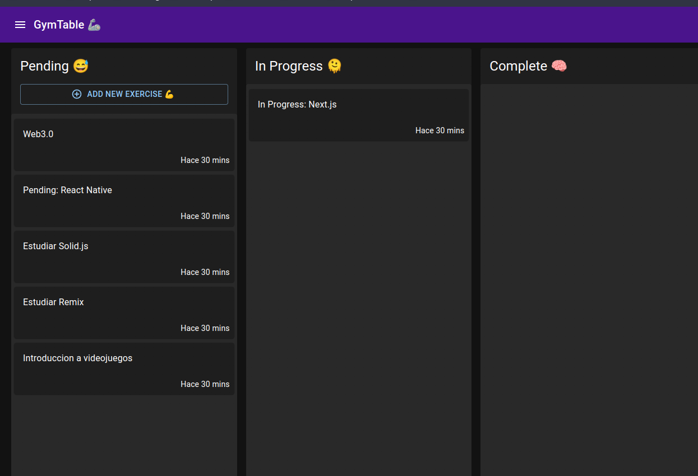

# GymTable- Tracker for gym

This is a solution to track your gym exercise

## Table of contents

- [Overview](#overview)
  - [Screenshot](#screenshot)
  - [Links](#links)
  - [Built with](#built-with)
  - [What I learned](#what-i-learned)
  - [Continued development](#continued-development)
- [Author](#author)

## Overview

This project is create with docker, mongodb and next.js, I deploy only the fron-end on vercel, but if you want you can run this project on your local machine, with this steps
Run the following commands

```
docker-compose up -d
```

- MongoDB URL Local:

```
mongodb://localhost:27017/entriesdb
```

- Configure .env variables

```
Configure on .env doc
```

- Insert data into BD

Call the endpoint:

```
http://localhost300/api/seed
```

### Screenshot



### Links

- Solution URL: [Code](https://github.com/mateocdev/openJira)
- Live Site URL: [Live](https://open-jira-chi.vercel.app/)

### Built with

- Next.js
- Material UI
- MongoDB
- Docker
- Mobile-first workflow

### What I learned

- Using middleware on Next.js
- MongoDB database
- Docker compose
- Docker yml
- Using some new features on MaterialUI

### Continued development

Vercel

## Author

- Website - [mateocdev](https://mateocdev.github.io/)
- Frontend Mentor - [@mateocdev](https://www.frontendmentor.io/profile/mateocdev)
